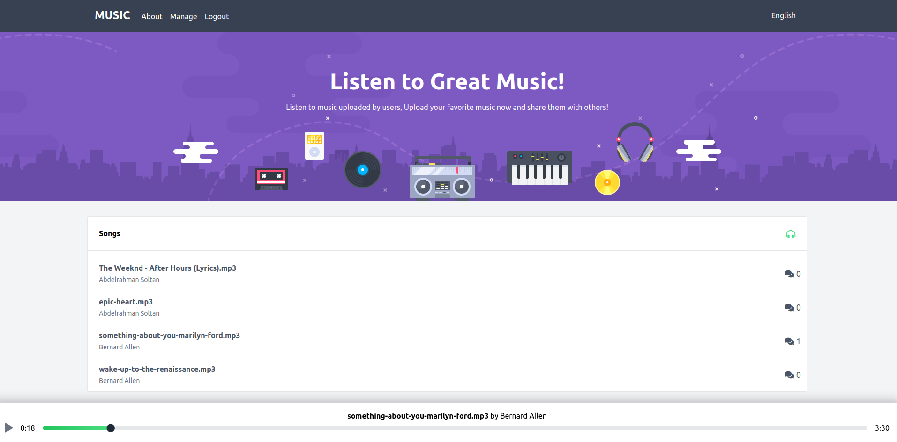
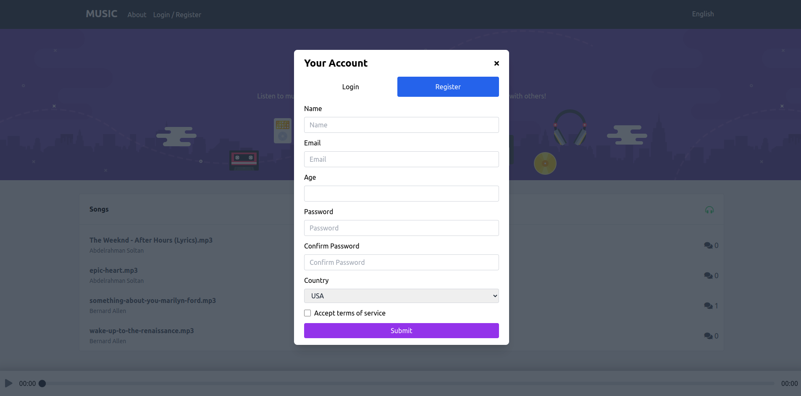
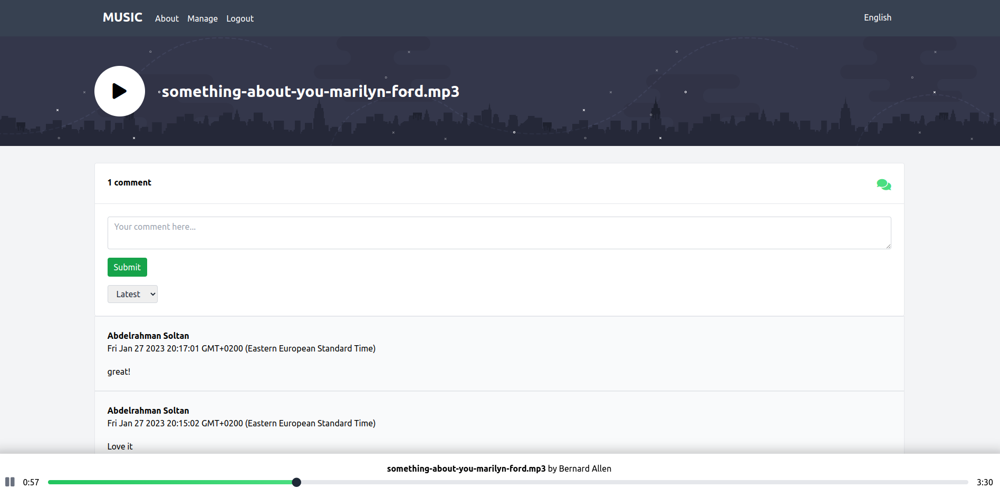
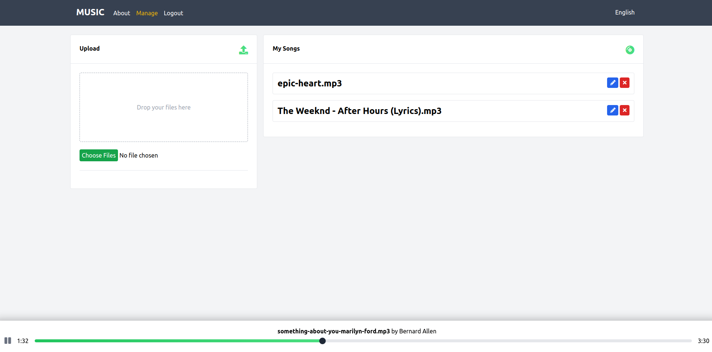

# Vue Music App

<div id="top"></div>


<!-- PROJECT LOGO -->
<div align="center">
  <br>
  <a href="https://vue-music-app-silk.vercel.app/">
      
    </a>
  <br>
  <br>

  <p align="center">
  <a href="https://vue-music-app-silk.vercel.app/">View Demo</a>
    ·
    <a href="https://github.com/abdrahmansoltan/Vue-Music-App/issues">Report Bug</a>
  </p>
</div>

<!-- TABLE OF CONTENTS -->
<details>
  <summary>Table of Contents</summary>
  <ol>
    <li>
      <a href="#about-the-project">About The Project</a>
      <ul>
        <li><a href="#features">Features</a></li>
        <li><a href="#built-with">Built With</a></li>
      </ul>
    </li>
    <li>
      <a href="#getting-started">Getting Started</a>
      <ul>
        <li><a href="#installation">Installation</a></li>
        <li><a href="#firebase">Firebase</a></li>
      </ul>
    </li>
    <li><a href="#contributing">Contributing</a></li>
  </ol>
</details>

<!-- ABOUT THE PROJECT -->

## About The Project

Music app created with Vue.js






### Features

- Listen and add comments to songs uploaded by users
- Login / Register through firebase authentication
- Upload mp3 songs using upload button or drag and drop feature
- Edit your uploaded Songs or delete them
- Internationalization: localization features with ability to switch between **English** or **French**
- Progressive Web App (**PWA**)
  - Caching
  - Offline browsing

### Built With

- Vue
- Vite
- Pinia
- Firebase
- Vue Router
- vee-validate
- vue-i18n
- Tailwind.CSS
- howler
- vite-plugin-pwa

<p align="right">(<a href="#top">back to top</a>)</p>

---

<!-- GETTING STARTED -->

## Getting Started

This project require some perquisites and dependencies to be installed, you can view it online using this [demo](https://vue-music-app-silk.vercel.app/). or you can find the instructions below:

> To get a local copy, follow these simple steps :

### Installation

#### installing Locally

1. Clone the repo

   ```sh
   git clone https://github.com/abdrahmansoltan/Vue-Music-App.git
   ```

2. go to project folder

   ```sh
   cd Vue-Music-App
   ```

3. install dependencies

   ```bash
   npm run install
   ```

4. Environmental Variables Set up

   - Here are the environmental variables that needs to be set in the `.env` file in the **main directory**.
   - These are the default setting that I used for development, but you can change it to what works for you.

   ```env
    VITE_FIREBASE_KEY=Your_Firebase_Api_Key
   ```

5. Run development server

   ```sh
   npm run dev
   ```

<p align="right">(<a href="#top">back to top</a>)</p>

---

### Firebase

#### Collections

- users
- songs
- comments

#### Rules

- FireStore Rules:

  ```js
  rules_version = '2';
  // select the database product service
  service cloud.firestore {
  // using (match) to check condition: if request is made to a specific resource
    match /databases/{database}/documents {
    // {database} is a variable placeholder with the name of the database that the request is trying to access
      // (documents) is the objects in the database
      match /{document=**} {
        allow read:if true; // allow anyone to read the database
        allow write: if request.auth.uid != null; // allow writing only for users with unique-ID in the request token
        allow create: if request.auth != null;
        allow delete: if request.auth.uid == resource.data.uid;
      }
    }
  }
  ```

- Storage Rules

  ```js
  rules_version = '2';
  service firebase.storage {
    match /b/{bucket}/o {
      match /{allPaths=**} {
        allow read: if true;
        allow write: if request.auth != null &&
                      request.resource.size < 10 * 1024 * 1024;
        allow delete: if request.auth != null;
      }
    }
  }
  ```

<p align="right">(<a href="#top">back to top</a>)</p>

---

<!-- CONTRIBUTING -->

## Contributing

Contributions are what make the open source community such an amazing place to learn, inspire, and create. Any contributions you make are **greatly appreciated**.

If you have a suggestion that would make this better, please fork the repo and create a pull request. You can also simply open an issue with the tag "enhancement".
Don't forget to give the project a star! Thanks again!

1. Fork the Project
2. Create your Feature Branch (`git checkout -b feature/AmazingFeature`)
3. Commit your Changes (`git commit -m 'Add some AmazingFeature'`)
4. Push to the Branch (`git push origin feature/AmazingFeature`)
5. Open a Pull Request

<p align="right">(<a href="#top">back to top</a>)</p>
